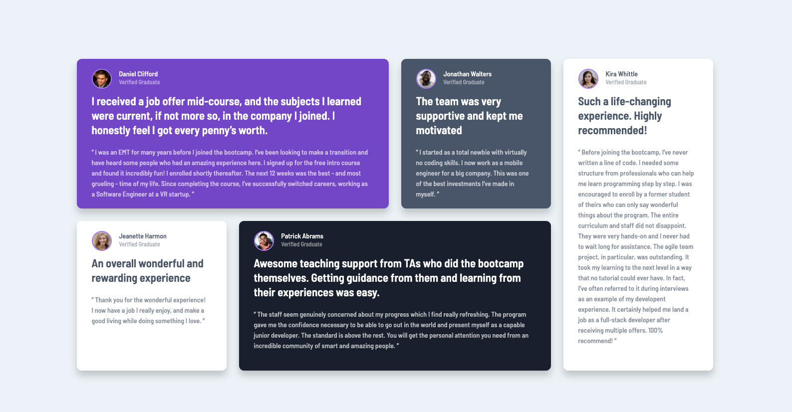

# Frontend Mentor - Testimonials grid section solution

This is a solution to the [Testimonials grid section challenge on Frontend Mentor](https://www.frontendmentor.io/challenges/testimonials-grid-section-Nnw6J7Un7). Frontend Mentor challenges help you improve your coding skills by building realistic projects.

## Table of contents

- [Overview](#overview)
  - [The challenge](#the-challenge)
  - [Screenshot](#screenshot)
  - [Links](#links)
- [My process](#my-process)
  - [Built with](#built-with)
  - [What I learned](#what-i-learned)
  - [Continued development](#continued-development)
  - [Useful resources](#useful-resources)
- [Author](#author)
- [Acknowledgments](#acknowledgments)

## Overview

### The challenge

Users should be able to:

- View the optimal layout for the site depending on their device's screen size

### Screenshot

### Links

- Solution URL: [Add solution URL here](https://github.com/bryanloyd/FrontEnd-Mentor---Testimonials-Grid-Section)
- Live Site URL: [Add live site URL here](https://bryanloyd.github.io/FrontEnd-Mentor---Testimonials-Grid-Section/)

## My process

### Built with

- Semantic HTML5 markup
- CSS custom properties
- Flexbox
- CSS Grid

### What I learned

### Continued development

I will continue to work on this project because I have been unable to have the mobile view to diplay correctly. The top 25% does not display on the mobile view. I think that it has to do with the display port reference line.

### Useful resources

- [Example resource 1](https://grid.malven.co/) - This helped me with setting up the grids for this project.
- [Example resource 2](https://developer.mozilla.org/en-US/docs/Web/CSS/background) - Trusty MDN comes through to remind of the various <background> properties.

## Author

- Website - [Bryan Loyd](https://bryanloyd.github.io/)
- Frontend Mentor - [@bryanloyd](https://www.frontendmentor.io/profile/bryanloyd)
- Twitter - [@loydweb](https://www.twitter.com/LoydWeb)
